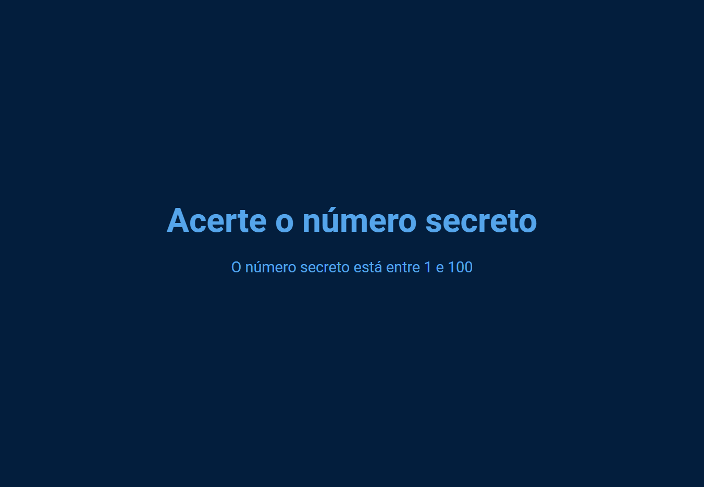

<h1 style="text-align: center">Jogo do número secreto</h1>

## 💻 Project

The goal with this project were to use the web speech API to create a game where the player needs to guess the correct number by saying a random number between two predetermined values and follow the hints given by the game to guess the secret number correctly.

  

The link to the game is [HERE](https://bpcampos.github.io/)
